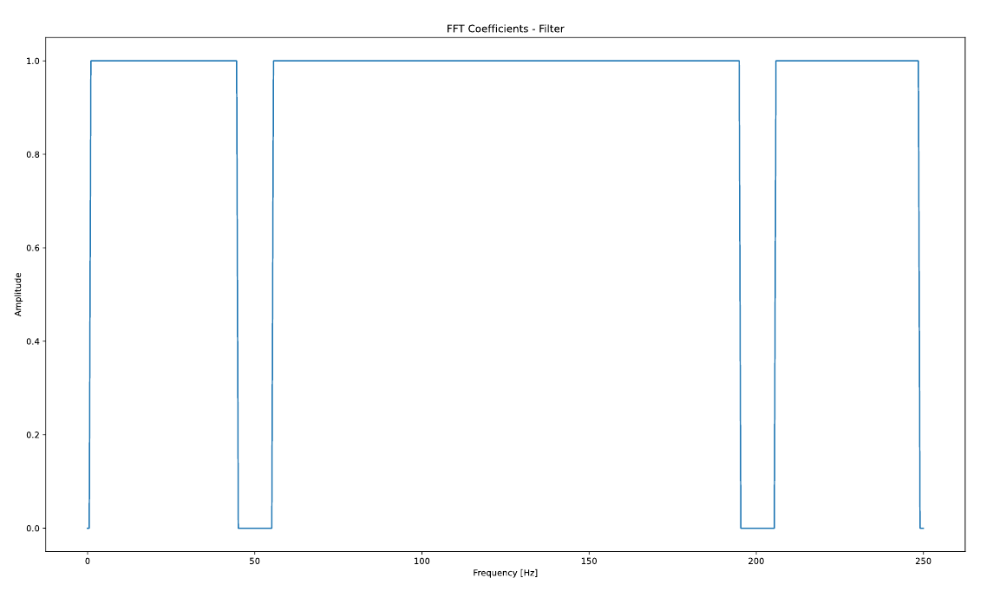
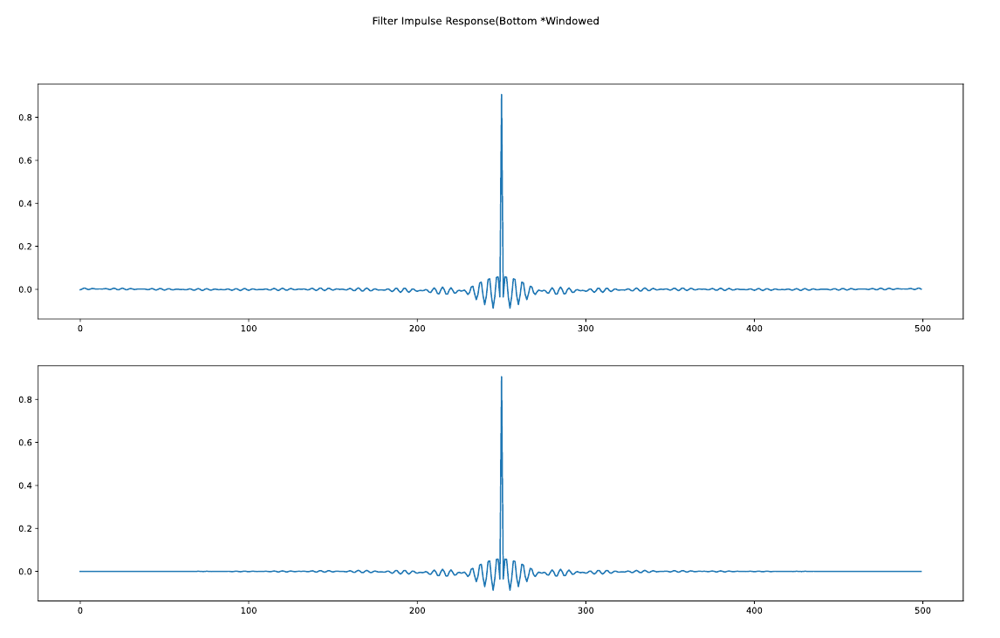
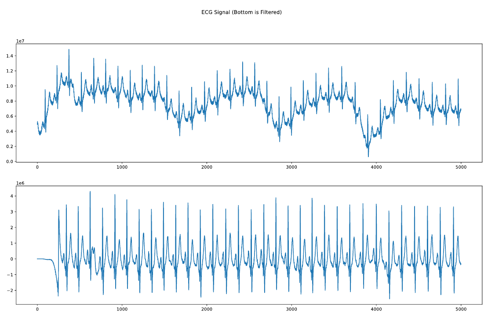
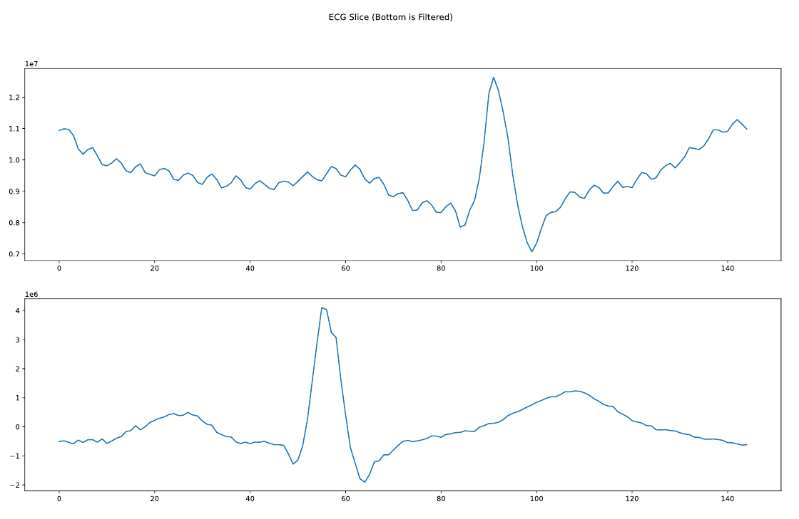
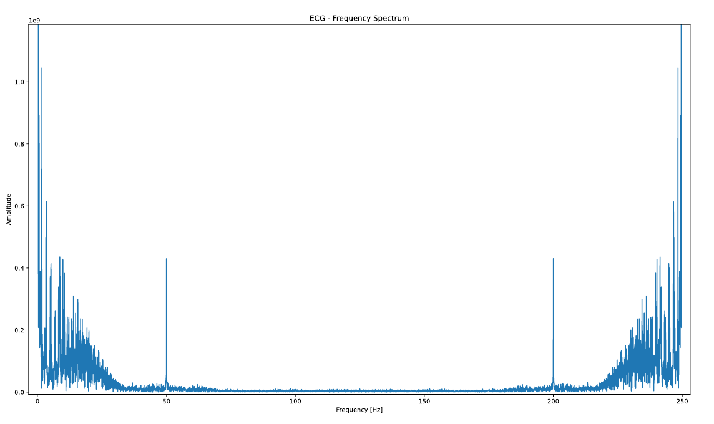
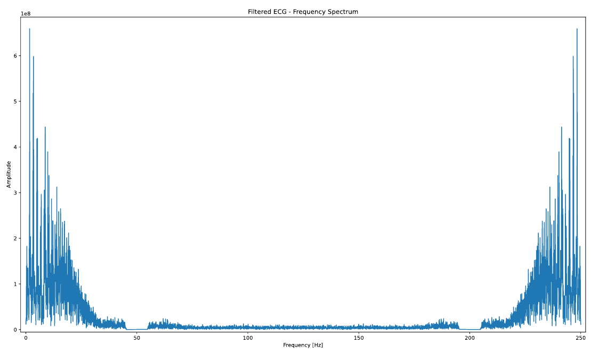

# ECG-filtering-py
Real-time casual ECG signal filtering simulation in python using FIR filters.

# Dependencies

```
pip install ecg_gudb_database
pip3 install ecg_gudb_database
```
Note: Stated dependecies are only required for the test purposes.

# Description

ECG filtering using efficient finite impulse repsonse filter implementation. In this example the FIR filter has been designed to remove DC component and noise centred around 50Hz. To obtain impulse response of the filter in time domain, the response was modelled in frequency domain and IFFT coefficients were computed using numpy’s fft library. These contained small complex components so were filtered too out to obtain real valued coefficients.



The first half of the coefficients of impulse are in positive time domain and the second half of coefficients are in negative time domain. The impulse response must be symmetrical in order to achieve linear phase; therefore, the elements were shifted. This was done by swapping the negative and positive coefficients (time-domain wise) around the middle element of the array which is half the number of taps. Then this impulse response was multiplied with Hanning window function was applited to smoothen the transition from the edges to the middle, ultimately reducing the ripples.



# Running Instructions

Run ecg_filter.py - Creates an FIR filter and applies it to an example ECG signal in real-time causal fashion and the creates the templates( for matched filter) for heart rate detector

Run hr_detect.py - Computes the heart rate from the ECG signal, to use the templated created by the ecg_filter use optional argument '--shortecg' otherwise the script will create use filtered Einthoven II recording slice as template.


## Results








